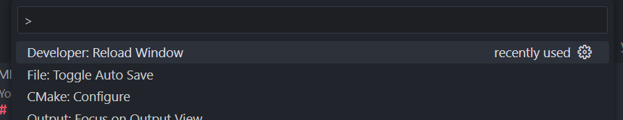
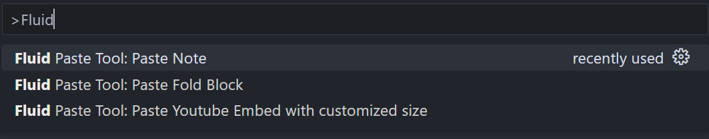

# hexo-snippet-paste-tool-for-fluid

This extension is tailored for [Hexo](https://hexo.io/index.html) users utilizing the [Fluid theme](https://github.com/fluid-dev/hexo-theme-fluid), providing automatic template snippet pasting.

## Features

* Paste snippet by typing and choosing the commands

## Requirements

* Tested and developed in VSCode `1.87.0`

## Extension Settings

No setting requirement

## Usage

* After installed the extension
* Press `F1` to open command

* Type in `Fluid Paste Tool`, you should see the commands like below by typing in a few characters

* All the available commands are listed below (Most of the snippets can be found in [Fluid Docs](https://hexo.fluid-dev.com/docs/en/guide/))
  * `Paste Youtube Embed with customized size`
  * `Paste Fold Block`
  * `Paste Note`
* Choose one of them to paste automatically to the editor (some commands may required to type in title or type etc. to customize the snippet)

## Known Issues

None so far

## Release Notes

### 1.0.0

Initial release of hexo-snippet-paste-tool-for-fluid
